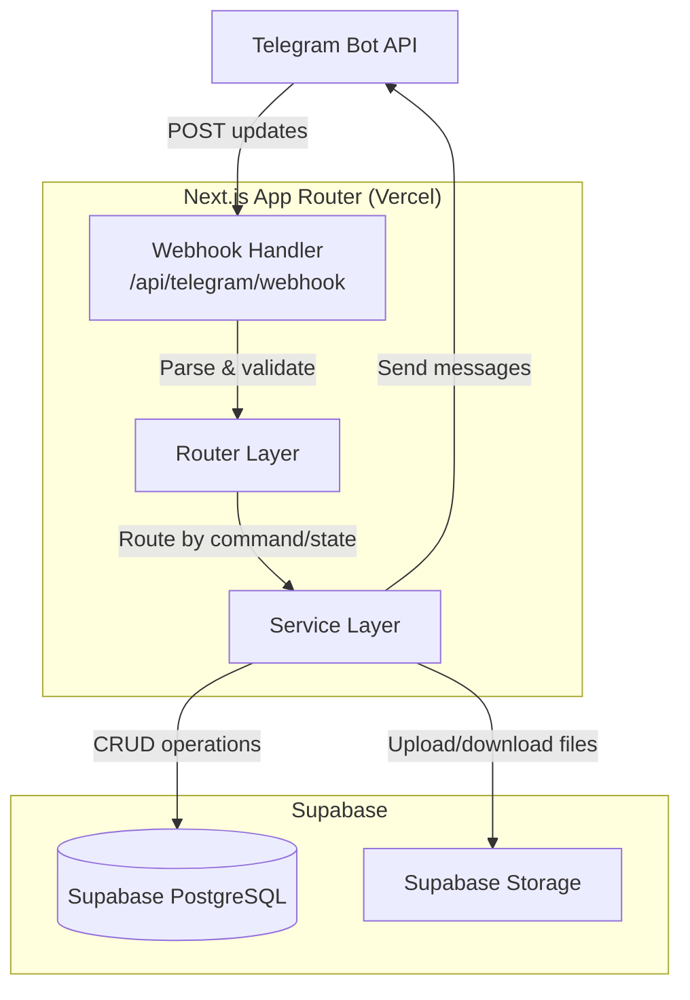
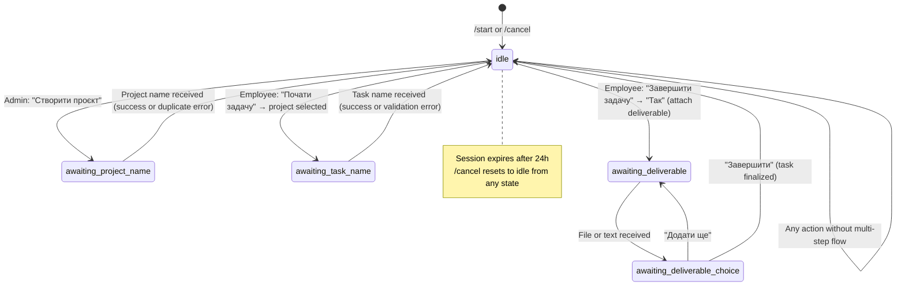
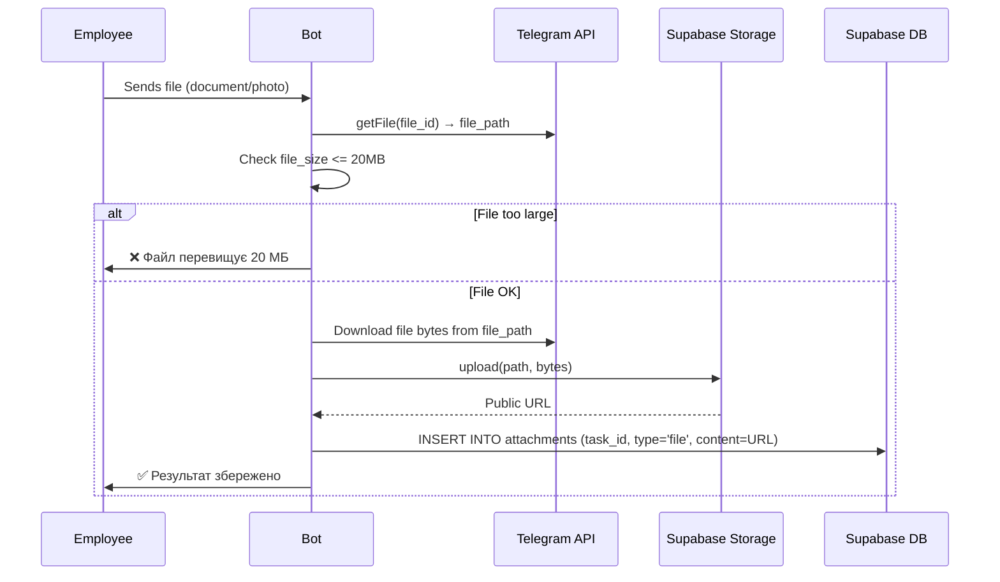
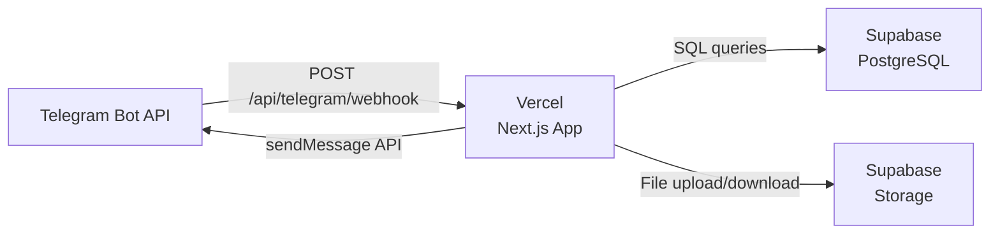

# Design Document: Telegram Time Tracker

## Overview

The Telegram Time Tracker is a webhook-based bot application built on Next.js (App Router) that enables employees to track their work time through Telegram conversations while providing administrators with monitoring and reporting capabilities. The system uses Supabase for PostgreSQL database and file storage, with deployment on Vercel.

### Core Capabilities

- **Employee Time Tracking**: Start, pause, resume, and complete tasks with automatic time logging
- **Project Management**: Admin-controlled project creation and lifecycle management
- **Deliverable Attachments**: File and text uploads stored in Supabase Storage
- **Activity Reporting**: Personal and team-wide time reports with filtering
- **Real-time Notifications**: Admin alerts for task start and completion events
- **Role-based Access Control**: Separate command sets and permissions for admin and employee roles

### Technology Stack

- **Frontend/Backend**: Next.js 14+ (App Router) with TypeScript
- **Database**: Supabase PostgreSQL with Row Level Security
- **File Storage**: Supabase Storage for attachments
- **Bot Platform**: Telegram Bot API (webhook mode)
- **Hosting**: Vercel (serverless functions)
- **Language**: All user-facing text in Ukrainian

### Key Design Principles

1. **Webhook-first Architecture**: All Telegram updates processed via HTTP POST to `/api/telegram/webhook`
2. **Stateful Conversations**: Session state persisted in database to handle multi-step flows
3. **Inline Keyboards**: Primary UI pattern for user choices (project selection, action menus)
4. **Asynchronous Processing**: Long operations handled after immediate HTTP 200 response
5. **Role Segregation**: Strict separation between admin and employee capabilities

---

## Architecture

### System Architecture Diagram



### Request Flow

1. **Telegram → Webhook**: User sends message or presses inline button
2. **Webhook Handler**: Validates request, extracts update data, responds HTTP 200 within 5s
3. **Router Layer**: Loads user session, determines current state, routes to appropriate handler
4. **Service Layer**: Executes business logic, updates database, manages session state
5. **Response**: Sends Telegram message with text and/or inline keyboard
6. **Notifications** (if applicable): Sends admin notifications asynchronously

### Component Responsibilities

| Component | Responsibility |
|-----------|---------------|
| **Webhook Handler** | Request validation, authentication, initial parsing, HTTP response |
| **Router** | Session loading, state machine navigation, command dispatch |
| **UserService** | User registration, role verification, user queries |
| **ProjectService** | Project CRUD, active project filtering |
| **TaskService** | Task lifecycle (start/pause/resume/complete), time calculation |
| **SessionService** | Session state management, context storage |
| **NotificationService** | Admin notification dispatch |
| **StorageService** | File upload/download to Supabase Storage |

---

## Components and Interfaces

### Project Structure

```
telegram-time-tracker/
├── src/
│   ├── app/
│   │   └── api/
│   │       └── telegram/
│   │           └── webhook/
│   │               └── route.ts          # POST handler
│   ├── lib/
│   │   ├── telegram/
│   │   │   ├── client.ts                 # Telegram API wrapper
│   │   │   ├── types.ts                  # Telegram type definitions
│   │   │   └── keyboards.ts              # Inline keyboard builders
│   │   ├── services/
│   │   │   ├── user.service.ts
│   │   │   ├── project.service.ts
│   │   │   ├── task.service.ts
│   │   │   ├── session.service.ts
│   │   │   ├── notification.service.ts
│   │   │   └── storage.service.ts
│   │   ├── handlers/
│   │   │   ├── router.ts                 # Main routing logic
│   │   │   ├── admin.handlers.ts         # Admin command handlers
│   │   │   └── employee.handlers.ts      # Employee command handlers
│   │   ├── db/
│   │   │   ├── client.ts                 # Supabase client
│   │   │   ├── schema.sql                # Database schema DDL
│   │   │   └── types.ts                  # Database type definitions
│   │   └── utils/
│   │       ├── time.ts                   # Time calculation utilities
│   │       ├── validation.ts             # Input validation
│   │       └── logger.ts                 # Logging utility
│   └── types/
│       └── index.ts                      # Shared TypeScript types
├── .env.local                            # Environment variables
└── package.json
```

### Core TypeScript Interfaces

```typescript
// Database Types
export type UserRole = 'admin' | 'employee';
export type TaskStatus = 'in_progress' | 'paused' | 'completed';
export type AttachmentType = 'file' | 'text';
export type SessionState = 
  | 'idle'
  | 'awaiting_project_name'
  | 'awaiting_task_name'
  | 'awaiting_deliverable'
  | 'awaiting_deliverable_choice';

export interface User {
  id: string;
  telegram_id: number;
  role: UserRole;
  first_name: string | null;
  username: string | null;
  created_at: string;
}

export interface Project {
  id: string;
  name: string;
  is_active: boolean;
  created_at: string;
}

export interface Task {
  id: string;
  project_id: string;
  user_id: string;
  name: string;
  status: TaskStatus;
  created_at: string;
}

export interface TimeLog {
  id: string;
  task_id: string;
  started_at: string;
  paused_at: string | null;
  ended_at: string | null;
}

export interface Attachment {
  id: string;
  task_id: string;
  type: AttachmentType;
  content: string; // URL for files, text for text
  created_at: string;
}

export interface Session {
  id: string;
  user_id: string;
  state: SessionState | null;
  context: Record<string, any> | null;
  updated_at: string;
}

// Service Interfaces
export interface TelegramUpdate {
  update_id: number;
  message?: TelegramMessage;
  callback_query?: TelegramCallbackQuery;
}

export interface TelegramMessage {
  message_id: number;
  from: TelegramUser;
  chat: TelegramChat;
  text?: string;
  document?: TelegramDocument;
  photo?: TelegramPhotoSize[];
}

export interface TelegramCallbackQuery {
  id: string;
  from: TelegramUser;
  message?: TelegramMessage;
  data?: string;
}

export interface TelegramUser {
  id: number;
  first_name: string;
  username?: string;
}

export interface TelegramChat {
  id: number;
  type: string;
}

export interface TelegramDocument {
  file_id: string;
  file_name?: string;
  file_size?: number;
}

export interface TelegramPhotoSize {
  file_id: string;
  width: number;
  height: number;
  file_size?: number;
}

// Handler Context
export interface HandlerContext {
  user: User;
  session: Session;
  telegramId: number;
  chatId: number;
}

// Time Calculation Result
export interface TimeSpent {
  hours: number;
  minutes: number;
  totalMinutes: number;
}

// Activity Report
export interface TaskActivity {
  taskName: string;
  projectName: string;
  status: TaskStatus;
  timeSpent: TimeSpent;
  startedAt: string;
}

export interface ProjectSummary {
  projectName: string;
  timeSpent: TimeSpent;
  taskCount: number;
}
```

---

## Data Models

### Database Schema (SQL DDL)

```sql
-- Enable UUID extension
CREATE EXTENSION IF NOT EXISTS "uuid-ossp";

-- Users table
CREATE TABLE users (
  id UUID PRIMARY KEY DEFAULT uuid_generate_v4(),
  telegram_id BIGINT UNIQUE NOT NULL,
  role TEXT NOT NULL CHECK (role IN ('admin', 'employee')),
  first_name TEXT,
  username TEXT,
  created_at TIMESTAMPTZ NOT NULL DEFAULT NOW()
);

CREATE INDEX idx_users_telegram_id ON users(telegram_id);
CREATE INDEX idx_users_role ON users(role);

-- Projects table
CREATE TABLE projects (
  id UUID PRIMARY KEY DEFAULT uuid_generate_v4(),
  name TEXT UNIQUE NOT NULL,
  is_active BOOLEAN NOT NULL DEFAULT TRUE,
  created_at TIMESTAMPTZ NOT NULL DEFAULT NOW()
);

CREATE INDEX idx_projects_is_active ON projects(is_active);

-- Tasks table
CREATE TABLE tasks (
  id UUID PRIMARY KEY DEFAULT uuid_generate_v4(),
  project_id UUID NOT NULL REFERENCES projects(id) ON DELETE CASCADE,
  user_id UUID NOT NULL REFERENCES users(id) ON DELETE CASCADE,
  name TEXT NOT NULL,
  status TEXT NOT NULL CHECK (status IN ('in_progress', 'paused', 'completed')),
  created_at TIMESTAMPTZ NOT NULL DEFAULT NOW()
);

CREATE INDEX idx_tasks_user_id ON tasks(user_id);
CREATE INDEX idx_tasks_project_id ON tasks(project_id);
CREATE INDEX idx_tasks_status ON tasks(status);
CREATE INDEX idx_tasks_created_at ON tasks(created_at);

-- Time logs table
CREATE TABLE time_logs (
  id UUID PRIMARY KEY DEFAULT uuid_generate_v4(),
  task_id UUID NOT NULL REFERENCES tasks(id) ON DELETE CASCADE,
  started_at TIMESTAMPTZ NOT NULL,
  paused_at TIMESTAMPTZ,
  ended_at TIMESTAMPTZ,
  CONSTRAINT valid_time_sequence CHECK (
    (paused_at IS NULL OR paused_at >= started_at) AND
    (ended_at IS NULL OR ended_at >= started_at)
  )
);

CREATE INDEX idx_time_logs_task_id ON time_logs(task_id);
CREATE INDEX idx_time_logs_started_at ON time_logs(started_at);

-- Attachments table
CREATE TABLE attachments (
  id UUID PRIMARY KEY DEFAULT uuid_generate_v4(),
  task_id UUID NOT NULL REFERENCES tasks(id) ON DELETE CASCADE,
  type TEXT NOT NULL CHECK (type IN ('file', 'text')),
  content TEXT NOT NULL,
  created_at TIMESTAMPTZ NOT NULL DEFAULT NOW()
);

CREATE INDEX idx_attachments_task_id ON attachments(task_id);

-- Sessions table
CREATE TABLE sessions (
  id UUID PRIMARY KEY DEFAULT uuid_generate_v4(),
  user_id UUID UNIQUE NOT NULL REFERENCES users(id) ON DELETE CASCADE,
  state TEXT,
  context JSONB,
  updated_at TIMESTAMPTZ NOT NULL DEFAULT NOW()
);

CREATE INDEX idx_sessions_user_id ON sessions(user_id);
CREATE INDEX idx_sessions_updated_at ON sessions(updated_at);
```

### Entity Relationships

```mermaid
erDiagram
    USERS ||--o{ TASKS : creates
    USERS ||--o| SESSIONS : has
    PROJECTS ||--o{ TASKS : contains
    TASKS ||--o{ TIME_LOGS : tracks
    TASKS ||--o{ ATTACHMENTS : has
    
    USERS {
        uuid id PK
        bigint telegram_id UK
        text role
        text first_name
        text username
        timestamptz created_at
    }
    
    PROJECTS {
        uuid id PK
        text name UK
        boolean is_active
        timestamptz created_at
    }
    
    TASKS {
        uuid id PK
        uuid project_id FK
        uuid user_id FK
        text name
        text status
        timestamptz created_at
    }
    
    TIME_LOGS {
        uuid id PK
        uuid task_id FK
        timestamptz started_at
        timestamptz paused_at
        timestamptz ended_at
    }
    
    ATTACHMENTS {
        uuid id PK
        uuid task_id FK
        text type
        text content
        timestamptz created_at
    }
    
    SESSIONS {
        uuid id PK
        uuid user_id FK_UK
        text state
        jsonb context
        timestamptz updated_at
    }
```

### Data Constraints and Business Rules

1. **User Uniqueness**: Each `telegram_id` maps to exactly one user record
2. **Role Enforcement**: Only `admin` and `employee` roles permitted
3. **Project Names**: Must be unique across all projects (active and inactive)
4. **Active Task Limit**: Each employee can have at most one task with status `in_progress`
5. **Time Log Integrity**: `paused_at` and `ended_at` must be >= `started_at`
6. **Session Staleness**: Sessions older than 24 hours are considered expired
7. **Attachment Size**: Files limited to 20 MB (enforced at application layer)
8. **Task Name Length**: Maximum 200 characters (enforced at application layer)

---


## Correctness Properties

*A property is a characteristic or behavior that should hold true across all valid executions of a system — essentially, a formal statement about what the system should do. Properties serve as the bridge between human-readable specifications and machine-verifiable correctness guarantees.*

### Property Reflection

Before listing properties, redundancy analysis was performed:

- Properties for task start confirmation (3.5) and task creation (3.3) can be combined — if a task is created correctly, the confirmation naturally follows from the same data.
- Properties for pause (4.x) and resume (5.x) are complementary state transitions that together form a round-trip property.
- Properties for admin notifications (11.x) and role-based access control (15.x) are distinct and non-redundant.
- Activity reporting (8.x) and admin monitoring (9.x) share the same time aggregation logic — one property covers both.
- Session save/load (12.1) and session expiry (12.3) are distinct properties.

After reflection, 10 unique properties remain.

---

### Property 1: Role Validation Rejects Invalid Values

*For any* string value provided as a user role, the system SHALL accept it if and only if it equals exactly `'admin'` or `'employee'`; all other values SHALL be rejected.

**Validates: Requirements 1.4**

---

### Property 2: Project Creation Sets Active Status

*For any* valid project name (non-empty, unique string), creating a project SHALL result in a database record with `is_active = true` and the exact name provided.

**Validates: Requirements 2.1**

---

### Property 3: Active Project Filter Excludes Inactive Projects

*For any* collection of projects with mixed `is_active` values, the list returned for employee project selection SHALL contain only projects where `is_active = true`, and SHALL contain all such projects.

**Validates: Requirements 2.4, 3.1**

---

### Property 4: Task Creation Produces Consistent State

*For any* valid task name (1–200 characters), project ID, and employee user ID, starting a task SHALL atomically create a `tasks` record with `status = 'in_progress'` and a `time_logs` record with `started_at` set to the current timestamp.

**Validates: Requirements 3.3**

---

### Property 5: Time Calculation Is Correct for Any Log Sequence

*For any* sequence of `time_logs` records for a task (each with `started_at` and either `paused_at` or `ended_at`), the total elapsed time SHALL equal the sum of `(paused_at OR ended_at) - started_at` across all intervals, with no interval counted more than once.

**Validates: Requirements 6.6**

---

### Property 6: Pause-Resume Round Trip Preserves Task Identity

*For any* task in `in_progress` status, pausing it (setting `paused_at`, status → `paused`) and then resuming it (creating a new `time_logs` record, status → `in_progress`) SHALL result in the task having the same `id`, `name`, `project_id`, and `user_id` as before, with an additional `time_logs` record.

**Validates: Requirements 4.3, 5.3**

---

### Property 7: Attachment Storage Round Trip

*For any* attachment (file URL or text content) saved to the `attachments` table for a given `task_id`, querying attachments by that `task_id` SHALL return a record containing the exact content that was stored.

**Validates: Requirements 7.2, 7.3**

---

### Property 8: Session State Persistence Round Trip

*For any* session state value and context object saved for a user, loading that user's session SHALL return the identical state and context, provided the session was updated within the last 24 hours.

**Validates: Requirements 12.1, 12.2**

---

### Property 9: Role-Based Access Control Rejects Unauthorized Actions

*For any* employee user attempting an admin-only action (project management, viewing all employees, viewing all tasks/logs), the system SHALL reject the request and return an access-denied message without performing any database mutation. Symmetrically, *for any* admin user attempting an employee-only action (start/pause/resume/complete task), the system SHALL reject the request.

**Validates: Requirements 15.2, 15.3**

---

### Property 10: Webhook Authentication Rejects Invalid Tokens

*For any* HTTP POST request to `/api/telegram/webhook` that carries an `X-Telegram-Bot-Api-Secret-Token` header value that does not match the configured secret, the system SHALL respond with HTTP 401 and SHALL NOT process the request body.

**Validates: Requirements 13.4**

---

## Session State Machine

### States

| State | Description |
|-------|-------------|
| `idle` | No active flow; main menu is shown |
| `awaiting_project_name` | Admin has chosen "Create Project", waiting for name input |
| `awaiting_task_name` | Employee has selected a project, waiting for task name input |
| `awaiting_deliverable` | Employee is in attachment flow, waiting for file or text |
| `awaiting_deliverable_choice` | Bot asked "Add another / Finish", waiting for button press |

### State Transitions



### Session Context Schema

The `context` JSONB field stores state-specific data:

```typescript
// When state = 'awaiting_task_name'
interface AwaitingTaskNameContext {
  selectedProjectId: string;
  selectedProjectName: string;
}

// When state = 'awaiting_deliverable' or 'awaiting_deliverable_choice'
interface AwaitingDeliverableContext {
  taskId: string;
  taskName: string;
  attachmentCount: number;
}
```

---

## Service Layer Design

### UserService

```typescript
interface UserService {
  // Find user by Telegram ID; returns null if not found
  findByTelegramId(telegramId: number): Promise<User | null>;
  
  // Create a new user (admin action)
  createUser(telegramId: number, role: UserRole, firstName?: string, username?: string): Promise<User>;
  
  // Get all employees with their weekly time totals
  getAllEmployeesWithWeeklyTime(): Promise<Array<User & { weeklyMinutes: number }>>;
  
  // Get display name (first_name or @username or telegram_id)
  getDisplayName(user: User): string;
}
```

### ProjectService

```typescript
interface ProjectService {
  // Get all active projects
  getActiveProjects(): Promise<Project[]>;
  
  // Get all projects (admin)
  getAllProjects(): Promise<Project[]>;
  
  // Create a new project; throws DuplicateProjectError if name exists
  createProject(name: string): Promise<Project>;
  
  // Deactivate a project (sets is_active = false)
  deactivateProject(projectId: string): Promise<void>;
  
  // Find project by ID
  findById(projectId: string): Promise<Project | null>;
}
```

### TaskService

```typescript
interface TaskService {
  // Start a new task; throws ActiveTaskExistsError if employee has in_progress task
  startTask(userId: string, projectId: string, taskName: string): Promise<{ task: Task; timeLog: TimeLog }>;
  
  // Pause the active task; throws NoActiveTaskError if none found
  pauseTask(userId: string): Promise<{ task: Task; timeLog: TimeLog }>;
  
  // Resume the paused task; throws NoPausedTaskError if none found
  resumeTask(userId: string): Promise<{ task: Task; timeLog: TimeLog }>;
  
  // Complete a task (in_progress or paused)
  completeTask(userId: string): Promise<{ task: Task; totalTime: TimeSpent }>;
  
  // Get active or paused task for user
  getActiveTask(userId: string): Promise<Task | null>;
  
  // Get tasks for user within date range
  getTasksForUser(userId: string, from: Date, to: Date): Promise<TaskActivity[]>;
  
  // Get all tasks with filters (admin)
  getTasksWithFilters(filters: { projectId?: string; userId?: string }, page: number): Promise<{ tasks: Task[]; total: number }>;
  
  // Get time logs for a task
  getTimeLogs(taskId: string): Promise<TimeLog[]>;
  
  // Calculate total time spent on a task
  calculateTotalTime(timeLogs: TimeLog[]): TimeSpent;
}
```

### SessionService

```typescript
interface SessionService {
  // Get or create session for user
  getSession(userId: string): Promise<Session>;
  
  // Update session state and context
  setState(userId: string, state: SessionState | null, context?: Record<string, any>): Promise<void>;
  
  // Reset session to idle
  resetSession(userId: string): Promise<void>;
  
  // Check if session is expired (> 24 hours)
  isExpired(session: Session): boolean;
}
```

### NotificationService

```typescript
interface NotificationService {
  // Notify all admins of task start
  notifyTaskStarted(employee: User, task: Task, project: Project, startedAt: Date): Promise<void>;
  
  // Notify all admins of task completion
  notifyTaskCompleted(employee: User, task: Task, project: Project, totalTime: TimeSpent, attachments: Attachment[]): Promise<void>;
}
```

### StorageService

```typescript
interface StorageService {
  // Upload file to Supabase Storage; returns public URL
  // Throws FileTooLargeError if size > 20MB
  uploadFile(fileId: string, fileName: string, fileSize: number): Promise<string>;
  
  // Save text attachment
  saveTextAttachment(taskId: string, text: string): Promise<Attachment>;
  
  // Save file attachment
  saveFileAttachment(taskId: string, url: string, fileName: string): Promise<Attachment>;
  
  // Get all attachments for a task
  getAttachments(taskId: string): Promise<Attachment[]>;
}
```

---

## Webhook Handler Design

### Route Handler (`/api/telegram/webhook/route.ts`)

```typescript
export async function POST(request: Request): Promise<Response> {
  // 1. Validate secret token header
  const secretToken = request.headers.get('X-Telegram-Bot-Api-Secret-Token');
  if (secretToken !== process.env.TELEGRAM_WEBHOOK_SECRET) {
    return new Response('Unauthorized', { status: 401 });
  }

  // 2. Parse request body
  let update: TelegramUpdate;
  try {
    update = await request.json();
  } catch {
    logger.error('Invalid JSON in webhook request');
    return new Response('OK', { status: 200 }); // Avoid Telegram retries
  }

  // 3. Respond immediately with 200 to satisfy Telegram's 5-second requirement
  // Process asynchronously
  processUpdate(update).catch((err) => {
    logger.error('Unhandled error in processUpdate', err);
  });

  return new Response('OK', { status: 200 });
}
```

### Update Processing Pipeline

```typescript
async function processUpdate(update: TelegramUpdate): Promise<void> {
  // Extract telegram_id and chat_id from message or callback_query
  const telegramId = update.message?.from.id ?? update.callback_query?.from.id;
  const chatId = update.message?.chat.id ?? update.callback_query?.message?.chat.id;
  
  if (!telegramId || !chatId) return;

  // Load user
  const user = await userService.findByTelegramId(telegramId);
  
  // Handle unregistered users
  if (!user) {
    await telegramClient.sendMessage(chatId, MESSAGES.NOT_REGISTERED);
    return;
  }

  // Load session (reset if expired)
  let session = await sessionService.getSession(user.id);
  if (sessionService.isExpired(session)) {
    await sessionService.resetSession(user.id);
    session = await sessionService.getSession(user.id);
  }

  // Handle /cancel command
  if (update.message?.text === '/cancel') {
    await sessionService.resetSession(user.id);
    await showMainMenu(chatId, user);
    return;
  }

  // Route to appropriate handler
  const context: HandlerContext = { user, session, telegramId, chatId };
  await router.route(update, context);
}
```

### Inline Keyboard Structures

```typescript
// Main menu for employees
const EMPLOYEE_MAIN_MENU = {
  inline_keyboard: [
    [{ text: '▶️ Почати задачу', callback_data: 'action:start_task' }],
    [{ text: '⏸ Пауза', callback_data: 'action:pause_task' }],
    [{ text: '▶️ Відновити', callback_data: 'action:resume_task' }],
    [{ text: '✅ Завершити задачу', callback_data: 'action:complete_task' }],
    [{ text: '📊 Моя активність', callback_data: 'action:my_activity' }],
  ]
};

// Main menu for admins
const ADMIN_MAIN_MENU = {
  inline_keyboard: [
    [{ text: '📁 Створити проєкт', callback_data: 'action:create_project' }],
    [{ text: '🚫 Деактивувати проєкт', callback_data: 'action:deactivate_project' }],
    [{ text: '👥 Співробітники', callback_data: 'action:employees' }],
    [{ text: '📋 Задачі та логи', callback_data: 'action:tasks_logs' }],
  ]
};

// Project selection keyboard (dynamically built)
function buildProjectKeyboard(projects: Project[]): InlineKeyboard {
  return {
    inline_keyboard: projects.map(p => [
      { text: p.name, callback_data: `project:${p.id}` }
    ])
  };
}

// Activity period selection
const ACTIVITY_PERIOD_KEYBOARD = {
  inline_keyboard: [
    [{ text: '📅 Сьогодні', callback_data: 'period:today' }],
    [{ text: '📆 Цей тиждень', callback_data: 'period:week' }],
  ]
};

// Deliverable choice keyboard
const DELIVERABLE_CHOICE_KEYBOARD = {
  inline_keyboard: [
    [{ text: '📎 Так', callback_data: 'deliverable:yes' }],
    [{ text: '⏭ Пропустити', callback_data: 'deliverable:skip' }],
  ]
};

// Add more / finish keyboard
const ADD_MORE_KEYBOARD = {
  inline_keyboard: [
    [{ text: '➕ Додати ще', callback_data: 'deliverable:add_more' }],
    [{ text: '✅ Завершити', callback_data: 'deliverable:finish' }],
  ]
};

// Pagination keyboard builder
function buildPaginationKeyboard(page: number, totalPages: number, prefix: string): InlineKeyboard {
  const buttons = [];
  if (page > 0) buttons.push({ text: '◀️ Назад', callback_data: `${prefix}:page:${page - 1}` });
  if (page < totalPages - 1) buttons.push({ text: 'Вперед ▶️', callback_data: `${prefix}:page:${page + 1}` });
  return { inline_keyboard: [buttons] };
}
```

---

## Supabase Storage Integration

### Storage Bucket Configuration

- **Bucket name**: `task-attachments`
- **Access**: Private (files accessed via signed URLs or service role)
- **File path pattern**: `{userId}/{taskId}/{timestamp}-{fileName}`
- **Max file size**: 20 MB (enforced at application layer before upload)

### File Upload Flow



### Supported File Types

- Documents: any file type sent as a Telegram document
- Photos: images sent as Telegram photos (highest resolution variant used)
- Text: plain text messages in the deliverable flow

---

## Error Handling Strategy

### Error Types

```typescript
// Domain errors
class ActiveTaskExistsError extends Error {}
class NoActiveTaskError extends Error {}
class NoPausedTaskError extends Error {}
class DuplicateProjectError extends Error {}
class FileTooLargeError extends Error {}
class UnauthorizedError extends Error {}
class ValidationError extends Error {}

// Infrastructure errors
class DatabaseError extends Error {}
class TelegramApiError extends Error {}
class StorageError extends Error {}
```

### Error Handling Matrix

| Error Type | User Message | Retry | Log |
|-----------|-------------|-------|-----|
| `ActiveTaskExistsError` | "У вас вже є активна задача. Спочатку поставте її на паузу або завершіть." | No | No |
| `NoActiveTaskError` | "Немає активної задачі." | No | No |
| `NoPausedTaskError` | "Немає задачі на паузі." | No | No |
| `DuplicateProjectError` | "Проєкт із такою назвою вже існує. Введіть іншу назву." | No | No |
| `FileTooLargeError` | "Файл перевищує 20 МБ. Будь ласка, надішліть менший файл." | No | No |
| `UnauthorizedError` | "У вас немає прав для виконання цієї дії." | No | No |
| `ValidationError` | "Назва задачі має бути від 1 до 200 символів." | No | No |
| `DatabaseError` | "Виникла технічна помилка. Спробуйте пізніше." | No | Yes |
| `TelegramApiError` (non-notification) | "Виникла помилка при відправці повідомлення." | Once (1s delay) | Yes |
| `TelegramApiError` (notification) | — (silent) | No | Yes |
| `StorageError` | "Виникла помилка при збереженні файлу. Спробуйте ще раз." | No | Yes |

### Global Error Handler

All unhandled errors in `processUpdate` are caught, logged, and a generic Ukrainian error message is sent to the user. The webhook always returns HTTP 200 to prevent Telegram from retrying.

---

## Testing Strategy

### Dual Testing Approach

The testing strategy combines unit/example-based tests for specific behaviors with property-based tests for universal correctness properties.

### Property-Based Testing

**Library**: `fast-check` (TypeScript-native, well-maintained)

**Configuration**: Minimum 100 iterations per property test.

**Tag format**: `// Feature: telegram-time-tracker, Property {N}: {property_text}`

Each correctness property from the design document maps to exactly one property-based test:

| Property | Test File | What Varies |
|----------|-----------|-------------|
| P1: Role validation | `user.service.test.ts` | Arbitrary strings as role values |
| P2: Project creation | `project.service.test.ts` | Random valid project names |
| P3: Active project filter | `project.service.test.ts` | Mixed collections of active/inactive projects |
| P4: Task creation state | `task.service.test.ts` | Random task names (1-200 chars), project/user IDs |
| P5: Time calculation | `time.utils.test.ts` | Random sequences of time_log intervals |
| P6: Pause-resume round trip | `task.service.test.ts` | Random task states |
| P7: Attachment round trip | `storage.service.test.ts` | Random file URLs and text content |
| P8: Session persistence | `session.service.test.ts` | Random state values and context objects |
| P9: Role-based access control | `router.test.ts` | All admin actions × employee users, all employee actions × admin users |
| P10: Webhook auth | `webhook.test.ts` | Random strings as secret tokens |

### Unit / Example-Based Tests

- `/start` command with registered and unregistered users
- Admin user creation flow
- Duplicate project name rejection
- Task name length validation (boundary: 1, 200, 201 chars)
- Pagination with exactly 10, 11, and 20 items
- `/cancel` command resets session from any state
- Session expiry (24h boundary)
- Notification failure is logged but does not abort task completion
- Webhook with invalid JSON returns 200

### Integration Tests

- Full task lifecycle: start → pause → resume → complete (with Supabase test instance)
- File upload to Supabase Storage and URL retrieval
- Admin notification delivery to multiple admin users

---

## Environment Variables

```bash
# Telegram Bot
TELEGRAM_BOT_TOKEN=          # Bot token from @BotFather
TELEGRAM_WEBHOOK_SECRET=     # Secret token for webhook validation

# Supabase
NEXT_PUBLIC_SUPABASE_URL=    # Supabase project URL
SUPABASE_SERVICE_ROLE_KEY=   # Service role key (server-side only, never exposed to client)
SUPABASE_STORAGE_BUCKET=     # Storage bucket name (e.g., task-attachments)

# Application
NEXT_PUBLIC_APP_URL=         # Deployed app URL (e.g., https://your-app.vercel.app)
```

> **Security note**: `SUPABASE_SERVICE_ROLE_KEY` must never be prefixed with `NEXT_PUBLIC_` and must only be used in server-side code (API routes). All secrets are read exclusively from environment variables and never hardcoded.

---

## Deployment Architecture

### Infrastructure Overview



### Vercel Configuration

- **Runtime**: Node.js (serverless functions via Next.js App Router)
- **Region**: Closest to Supabase instance (e.g., `fra1` for EU)
- **Timeout**: Default 10s for webhook handler (async processing handles longer operations)
- **Environment Variables**: Set in Vercel project settings (not in `.env` files in production)

### Supabase Configuration

- **Database**: PostgreSQL with schema applied via migration files
- **Storage**: `task-attachments` bucket with private access policy
- **Row Level Security**: Disabled (access controlled at application layer via service role key)
- **Connection**: Direct connection via `@supabase/supabase-js` with service role key

### Telegram Webhook Setup

After deployment, register the webhook once:

```bash
curl -X POST "https://api.telegram.org/bot{TELEGRAM_BOT_TOKEN}/setWebhook" \
  -H "Content-Type: application/json" \
  -d '{
    "url": "https://your-app.vercel.app/api/telegram/webhook",
    "secret_token": "{TELEGRAM_WEBHOOK_SECRET}",
    "allowed_updates": ["message", "callback_query"]
  }'
```

### Deployment Checklist

1. Create Supabase project and apply `schema.sql`
2. Create `task-attachments` storage bucket in Supabase
3. Deploy Next.js app to Vercel with all environment variables set
4. Register Telegram webhook with the deployed URL
5. Verify webhook with `getWebhookInfo` API call
6. Test `/start` command with a registered admin user
